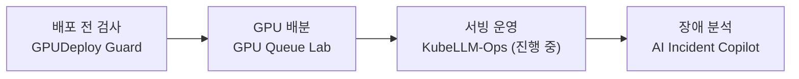

# 안녕하세요, 유은수입니다 👋

**AI 인프라 엔지니어를 준비하고 있습니다.**
ITS 현장에서 CCTV·VMS 장비 장애를 직접 다뤄 본 경험을 바탕으로,
**GPU를 놀리지 않고, 배포 전에 실패를 막고, 장애가 나도 근거로 설명할 수 있는 인프라**를 만드는 데 관심이 있습니다.

---

## 🚀 대표 프로젝트

| 프로젝트 | 무엇을 하나 | 핵심 결과 |
|---|---|---|
| [**GPU Queue Lab**](https://github.com/eunsu7997/gpu-queue-lab) | 여러 팀이 GPU를 빌려 쓰고, 주인이 오면 되찾는 쿠버네티스 작업 대기열 (Kueue) | 실제 RTX 4060에서 3회 반복 측정: 작은 학습 작업 완료 시간 **-19%**, 체크포인트로 선점 후 다시 학습하는 시간 **178초 → 0초** |
| [**GPUDeploy Guard**](https://github.com/eunsu7997/gpu-deploy-guard) | GPU/LLM 워크로드를 배포하기 전에 실제로 올라갈 수 있는지 미리 검사하는 CLI | 배포 전 판정과 실제 쿠버네티스 스케줄러의 실패 원인 **일치(MATCH)**, 노드 단위 GPU 적합성·taint·affinity 규칙 검증, CI 통과 |
| [**AI Incident Copilot**](https://github.com/eunsu7997/incident-copilot) | LLM이 장애 원인 후보를 내고, 코드가 인용 근거를 검증하고, 사람이 최종 판단 | 존재하지 않는 로그 ID 인용 자동 검출, 평가 기준을 실행 전에 고정하고 미충족 결과까지 공개 |

> GPU Queue Lab은 처음에 가짜 GPU(KWOK) 시뮬레이션에서 완료 시간 243초 → 121초를 얻었지만, 설정만 봐도 예상되는 숫자라서 실제 GPU에서 다시 쟀습니다.
> 큰 학습 작업에서는 이득이 **-1%**에 그쳤고, 그 결과도 그대로 남겼습니다.

네 프로젝트는 AI 모델이 GPU에서 학습되고 서비스로 나가기까지의 흐름을 단계별로 하나씩 다룹니다.

## 🔧 진행 중

- **KubeLLM-Ops** — 쿠버네티스 위 LLM 서빙 운영. Mock Backend 기준으로 장애 재현 → Prometheus·Grafana 관측 → Pod 자동복구(약 9초)까지 확인했고, 실제 vLLM 서빙은 진행 중입니다. ([정리 노트](https://app.notion.com/p/3e746d96621a8170b6c6f5e04b0ccfc4))
- 집 PC(RTX 4060)에서 vLLM 서빙과 실제 GPU 검증
- SK 알레프 AI 인프라 과정 수강 중 — 과정 과제는 [`aleph-course`](https://github.com/search?q=user%3Aeunsu7997+topic%3Aaleph-course&type=repositories) 토픽으로 묶어 두었습니다

## 🧭 일하는 원칙

- **숫자로 말합니다.** 결과에는 실행 기록이나 CI 기록이 함께 있습니다.
- **과장하지 않습니다.** 직접 돌려서 확인한 것만 완료로 적고, 시뮬레이션과 실제 환경을 구분합니다.
- **실패도 기록합니다.** 실패한 결과와 한계, 다음 개선 방법까지 남깁니다.
- **AI 도구 사용을 숨기지 않습니다.** 코드 작성에는 Claude Code·Codex를 쓰고, 무엇을 만들지와 검증 기준, 결과가 맞는지는 직접 판단합니다.
