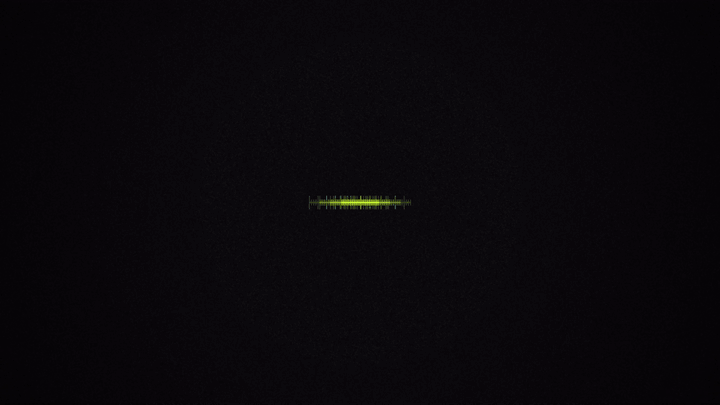
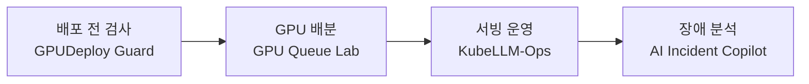

  
   ▶ 클릭하면 사운드 포함 고화질 영상(15s · 1080p60)

# 안녕하세요, 유은수입니다 👋

**AI 인프라 엔지니어를 준비하고 있습니다.**
ITS 현장에서 CCTV·VMS 장비 장애를 직접 다뤄 본 경험을 바탕으로,
**GPU를 놀리지 않고, 배포 전에 실패를 막고, 장애가 나도 근거로 설명할 수 있는 인프라**를 만드는 데 관심이 있습니다.

---

## 🚀 대표 프로젝트

| 프로젝트 | 무엇을 하나 | 핵심 결과 |
|---|---|---|
| [**GPU Queue Lab**](https://github.com/eunsu7997/gpu-queue-lab) | 여러 팀이 GPU를 빌려 쓰고, 주인이 오면 되찾는 쿠버네티스 작업 대기열 (Kueue) | 완료 시간 **243초 → 121초**, GPU 사용률 **50% → 98%** |
| [**GPUDeploy Guard**](https://github.com/eunsu7997/gpu-deploy-guard) | GPU/LLM 워크로드를 배포하기 전에 실제로 올라갈 수 있는지 미리 검사하는 CLI | 테스트 **509개**, GitHub Actions 통과 |
| [**AI Incident Copilot**](https://github.com/eunsu7997/incident-copilot) | LLM이 장애 원인 후보를 내고, 코드가 근거를 검증하고, 사람이 최종 판단 | 테스트 **25개**, 실제 LLM 실행 증거 4건 |
| **KubeLLM-Ops** (정리 중) | 쿠버네티스 위 LLM 서빙을 모니터링하고 장애를 재현해 복구까지 확인 | Pod 삭제 후 **약 9초** 내 복구 |

네 프로젝트는 AI 모델이 GPU에서 학습되고 서비스로 나가기까지의 흐름을 단계별로 하나씩 다룹니다.

## 🧭 일하는 원칙

- **숫자로 말합니다.** 결과에는 실행 기록이나 CI 기록이 함께 있습니다.
- **과장하지 않습니다.** 직접 돌려서 확인한 것만 완료로 적고, 시뮬레이션과 실제 환경을 구분합니다.
- **실패도 기록합니다.** 실패한 결과와 한계, 다음 개선 방법까지 남깁니다.

## 📚 지금 하고 있는 것

- SK 알레프 AI 인프라 과정 수강 중
- 집 PC(RTX 4060)에서 vLLM 서빙과 실제 GPU 검증 진행 중
